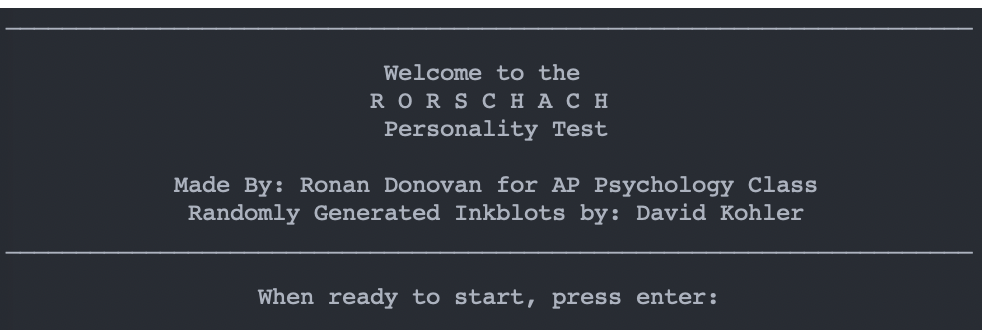
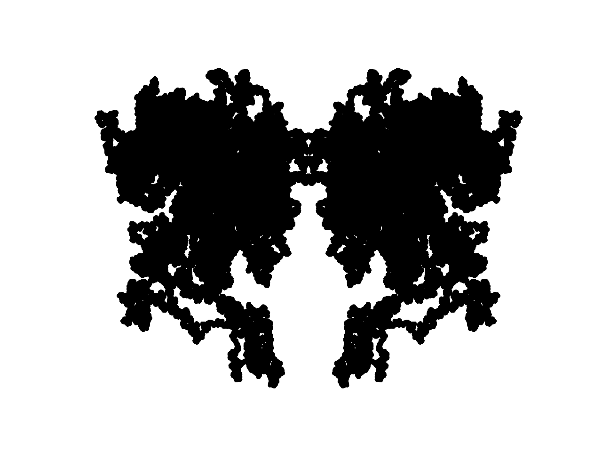

# Rorschach Test

This is a simple Python program that I wrote in high-school for a Psychology project.
Note that the directories are hardcoded into the program. 

Upon running the program, the user will experience a variety of radomly generated images and then will respond to the prompts. Completion of viewing the 10 images will result in a conclusion about the viewers mental state. 

NOTICE: This is a simple program, and is no way intended to be used for any sort of medical diagnostics. Please use at your own discretion and enjoyment. 
